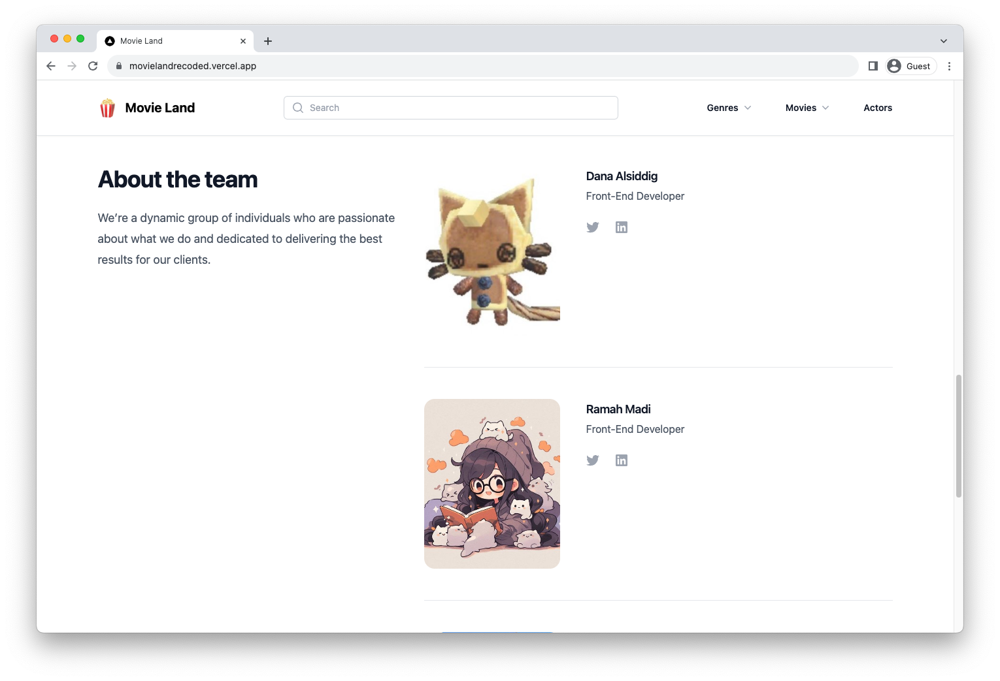

# Entertainment web app

## Table of contents

- [Entertainment web app](#entertainment-web-app)
  - [Table of contents](#table-of-contents)
  - [Overview](#overview)
    - [Summary](#summary)
    - [Links](#links)
    - [Screenshot](#screenshot)
  - [Details](#details)
    - [Project purpose and goal](#project-purpose-and-goal)
    - [Web stack and explanation](#web-stack-and-explanation)
  - [Getting started](#getting-started)
    - [Prerequisites](#prerequisites)
    - [Installing](#installing)
  - [Contributing](#contributing)

## Overview

### Summary

An entertainment web app built with Next.js and TailwindCSS that allows users to search for movies and tv shows.

### Links

- Solution URL: [GitHub](https://github.com/202309-EKTA-JO-FSW/movie-project-room-15)
- Live Site URL: [Vercel](https://movielandrecoded.vercel.app/)

## Features 🌟

Discover Movies 🎥
Explore a vast collection of movies at your fingertips. From timeless classics to the hottest releases, MovieLand helps you discover new favorites.

## Popular Movies 🌟

Want to know what everyone's talking about? Check out the popular movies section to stay in the loop and catch up on trending films.

## Trending Now 🚀

Curious about what's trending in the movie world? Our trending now section keeps you updated on the latest buzzworthy releases.

## Genre Exploration 🎭

Love a specific genre? Dive into our genre section to find a curated selection of movies tailored to your taste. From action-packed adventures to heartwarming romances, we've got it all.

## Actor Spotlight 🌟

Explore the fascinating world of actors. Discover biographies, filmographies, and more. Who's your favorite actor? Find out everything about them here.

### Screenshot





## Details

### Project purpose and goal

The main purpose of this project is to take advantages of the capabilities of Next.js and have a functional web app up and running quickly. Secondly, I want to become familiar with the framework itself and its convenient features.

### Web stack and explanation

- Semantic HTML5 markup
- Flexbox
- Mobile-first workflow
- [Next.js](https://nextjs.org/)
- [TailwindCSS](https://tailwindcss.com/)

## Getting started

These instructions will get you a copy of the project up and running on your local machine for development and testing purposes.

### Prerequisites

1. Create an API KEY for the [TMDB API](https://www.themoviedb.org/documentation/api)
2. Create an `.env.local` file in the root directory of the project
3. Add 2 environment variables to the `.env.local` file:

```env
// .env.local

TMDB_ENDPOINT="https://api.themoviedb.org/3"
TMDB_API_KEY="YOUR_TMDB_API_KEY"
```

### Installing

Clone the repository and run the development server:

```bash
npm install
npm run dev
# or
yarn install
yarn dev
```

## Contributing

Please feel free to send pull request if you want to contribute!
